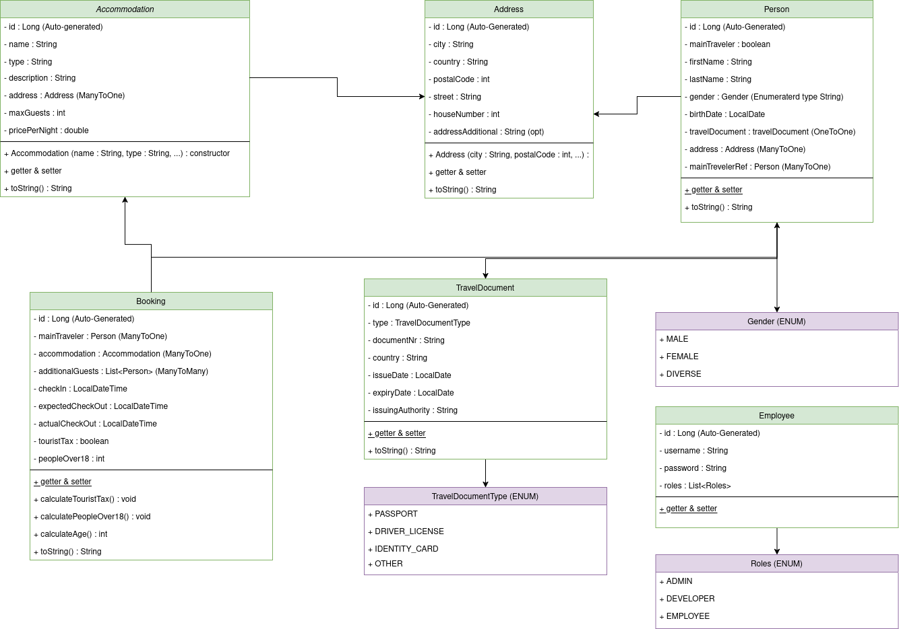

# equilibria-sharing_backend

### UML:

### Local Deployment

Um das Projekt lokal zu starten, benötigt man die folgenden Sachen:

- Java 17
- Maven
- Docker & Docker Compose

Und, wenn man es besonders leicht haben möchte:
- IntelliJ (das übernimmt das meiste für dich, inkl. dependencies und datenbank)

Als nächstes sollte man das Projekt mit dem Ausführen der `EquilibriaSharingApplication.java` Datei starten können. 
Die Datenbank sollte sich automatisch per Docker aufsetzen und eine Verbindung aufbauen.

### API Dokumentation - BookingController

Der **BookingController** stellt Endpunkte zur Verwaltung von Buchungen (Bookings) bereit. Hierüber können Buchungen erstellt, abgerufen, aktualisiert und gelöscht werden.

**Basis-URL:** `/api/v1/bookings`

---

## Endpunkte

### 1. Buchung erstellen

- **Methode:** `POST`
- **URL:** `/api/v1/bookings`
- **Beschreibung:**  
  Erstellt eine neue Buchung anhand der übermittelten Formulardaten vom Kunden. Dabei werden die zugehörigen Objekte wie Unterkunft, Hauptreisender (inklusive Adresse und Reisedokument) sowie zusätzliche Gäste verarbeitet und gespeichert.
- **Request Body:**  
  Das Request-Objekt ist vom Typ `BookingRequest` und sollte folgende Felder enthalten:
    - `accommodationId`  
      ID der Unterkunft.
    - `mainTraveler`  
      Objekt mit folgenden Attributen:
        - `firstName`
        - `lastName`
        - `gender`
        - `birthDate`
        - `street`
        - `city`
        - `country`
        - `houseNumber`
        - `postalCode`
        - `addressAdditional`
        - `travelDocumentType`
        - `documentNr`
        - `issueDate`
        - `expiryDate`
        - `issuingAuthority`
    - `checkIn`  
      Datum des Check-ins.
    - `expectedCheckOut`  
      Voraussichtliches Datum des Check-outs.
    - `additionalGuests`  
      Liste von Objekten, die zusätzliche Gäste repräsentieren. Jedes Objekt enthält:
        - `firstName`
        - `lastName`
        - `birthDate`
- **Response:**
    - **Erfolgreich:**
        - **Status:** `201 Created`
        - **Body:** JSON-Darstellung des erstellten `Booking`-Objekts, inklusive berechneter Felder wie `touristTax` und `peopleOver18`.
    - **Fehler:**
        - `404 Not Found`, falls die angegebene Unterkunft nicht existiert.

---

### 2. Buchung nach ID abrufen

- **Methode:** `GET`
- **URL:** `/api/v1/bookings/{id}`
- **Beschreibung:**  
  Ruft eine spezifische Buchung anhand der übergebenen Buchungs-ID ab.
- **Pfadparameter:**
    - `id`: ID der Buchung.
- **Response:**
    - **Erfolgreich:**
        - **Status:** `200 OK`
        - **Body:** JSON-Darstellung des gefundenen `Booking`-Objekts.
    - **Fehler:**
        - `404 Not Found`, wenn keine Buchung mit der angegebenen ID existiert.

---

### 3. Alle Buchungen abrufen

- **Methode:** `GET`
- **URL:** `/api/v1/bookings`
- **Beschreibung:**  
  Gibt eine Liste aller gespeicherten Buchungen zurück.
- **Response:**
    - **Status:** `200 OK`
    - **Body:** JSON-Array aller `Booking`-Objekte.

---

### 4. Alle Buchungen löschen

- **Methode:** `DELETE`
- **URL:** `/api/v1/bookings`
- **Beschreibung:**  
  Löscht sämtliche Buchungen in der Datenbank.
- **Response:**
    - **Status:** `200 OK`

---

### 5. Buchung nach ID löschen

- **Methode:** `DELETE`
- **URL:** `/api/v1/bookings/{id}`
- **Beschreibung:**  
  Löscht eine spezifische Buchung anhand der übergebenen ID.
- **Pfadparameter:**
    - `id`: ID der Buchung.
- **Response:**
    - **Status:** `200 OK`

---

### 6. Buchung aktualisieren

- **Methode:** `PUT`
- **URL:** `/api/v1/bookings/{id}`
- **Beschreibung:**  
  Aktualisiert eine bestehende Buchung. Hierbei werden alle bisherigen Daten durch die neuen Daten aus dem Request ersetzt.
- **Pfadparameter:**
    - `id`: ID der zu aktualisierenden Buchung.
- **Request Body:**  
  Gleiches Format wie bei der Buchungserstellung (`BookingRequest`):
    - `accommodationId`
    - `mainTraveler` (mit allen relevanten Feldern wie oben)
    - `checkIn`
    - `expectedCheckOut`
    - `additionalGuests` (Liste von Gastobjekten)
- **Response:**
    - **Erfolgreich:**
        - **Status:** `200 OK`
        - **Body:** JSON-Darstellung des aktualisierten `Booking`-Objekts.
    - **Fehler:**
        - `404 Not Found`, wenn die Buchung oder die angegebene Unterkunft nicht gefunden wird.

---

## Beispielanfrage (POST /api/v1/bookings)

```json
{
  "accommodationId": 123,
  "mainTraveler": {
    "firstName": "Max",
    "lastName": "Mustermann",
    "gender": "M",
    "birthDate": "1990-01-01",
    "street": "Musterstraße",
    "city": "Musterstadt",
    "country": "Deutschland",
    "houseNumber": "1",
    "postalCode": "12345",
    "addressAdditional": "Etage 2",
    "travelDocumentType": "Passport",
    "documentNr": "A1234567",
    "issueDate": "2020-01-01",
    "expiryDate": "2030-01-01",
    "issuingAuthority": "Musteramt"
  },
  "checkIn": "2025-05-01",
  "expectedCheckOut": "2025-05-10",
  "additionalGuests": [
    {
      "firstName": "Erika",
      "lastName": "Mustermann",
      "birthDate": "1992-02-02"
    }
  ]
}
```

## Beispielantwort (210 created)

```json
{
  "id": 1,
  "accommodation": { /* Unterkunftsdaten */ },
  "mainTraveler": { /* Hauptreisenden-Daten */ },
  "additionalGuests": [ /* Liste von zusätzlichen Gästen */ ],
  "checkIn": "2025-05-01",
  "expectedCheckOut": "2025-05-10",
  "touristTax": 15.0,
  "peopleOver18": 2
}

```