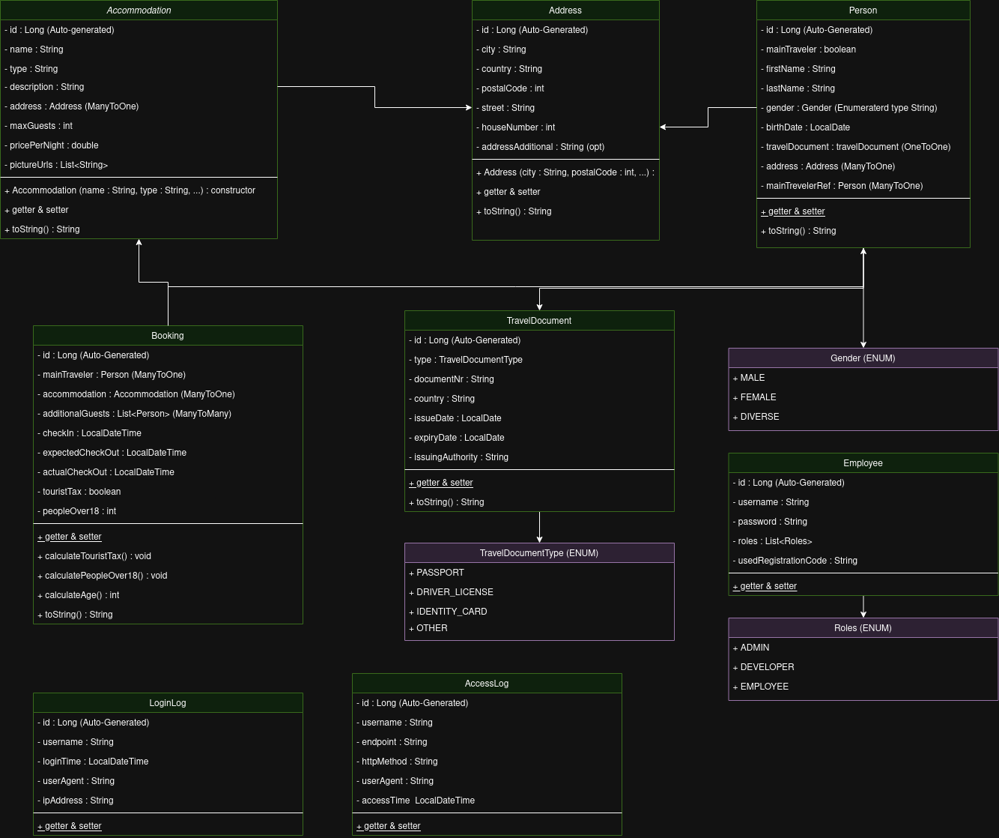

# equilibria-sharing_backend

### UML:

### Local Deployment

Um das Projekt lokal zu starten, benötigt man die folgenden Sachen:

- Java 17
- Maven
- Docker & Docker Compose

Und, wenn man es besonders leicht haben möchte:
- IntelliJ (das übernimmt das meiste für dich, inkl. dependencies und datenbank)

Als nächstes sollte man das Projekt mit dem Ausführen der `EquilibriaSharingApplication.java` Datei starten können.
Die Datenbank sollte sich automatisch per Docker aufsetzen und eine Verbindung aufbauen.

Als nächstes muss ein File namens `application.properties` im `/resources` Folder erstellt werden, welches die folgende Struktur haben soll:


```text
spring.application.name=equilibria-sharing

# MariaDB connection properties, TEMPORARY DATA!
spring.datasource.url=jdbc:mariadb://localhost:3306/mydatabase
spring.datasource.username=myuser
spring.datasource.password=secret

# JDBC driver for MariaDB
spring.datasource.driver-class-name=org.mariadb.jdbc.Driver

# Hibernate properties (optional, for JPA usage)
spring.jpa.hibernate.ddl-auto=update
spring.jpa.database-platform=org.hibernate.dialect.MariaDBDialect


server.servlet.session.timeout=30m

employeeRegistrationCode=code

secretJwtKey=keys
```

Make sure to replace each of these attributes with your own secure ones.

### API Dokumentation - BookingController & AuthController

## Authentifizierung in der Anwendung

Die Anwendung verwendet eine Token-basierte Authentifizierung mittels JWT (JSON Web Tokens). Mitarbeiter müssen sich anmelden, um geschützte Endpunkte zu nutzen. Bei erfolgreicher Anmeldung wird ein JWT-Token zurückgegeben, der bei nachfolgenden Anfragen im `Authorization`-Header mitgesendet werden muss.

**Token-Format:**
```
Authorization: Bearer <jwt-token>
```

### AuthController

**Basis-URL:** `/auth`

#### 1. Mitarbeiter-Login

- **Methode:** `POST`
- **URL:** `/auth/login`
- **Beschreibung:**
  Authentifiziert einen Mitarbeiter mit Benutzername und Passwort. Gibt bei Erfolg einen JWT-Token zurück.
- **Request Body:**
```json
{
  "username": "mitarbeiter1",
  "password": "passwort123"
}
```
- **Response:**
    - **Status:** `200 OK`
    - **Body:** Der generierte JWT-Token.

#### 2. Mitarbeiter-Registrierung

- **Methode:** `POST`
- **URL:** `/auth/register`
- **Beschreibung:**
  Registriert einen neuen Mitarbeiter. Erfordert einen `uniqueCode`, der aus der Datei `application.properties` geladen wird (Schlüssel: `employeeRegistrationCode`).
- **Request Body:**
```json
{
  "username": "neuerMitarbeiter",
  "password": "starkesPasswort",
  "uniqueCode": "SPECIAL123"
}
```
- **Response:**
    - **Status:** `200 OK`
    - **Body:** Meldung über die erfolgreiche Registrierung.

---

### Ablauf der Authentifizierung

1. Der Mitarbeiter sendet einen `POST`-Request an `/auth/login` mit gültigen Zugangsdaten.
2. Die Anwendung prüft die Zugangsdaten:
    - Bei Erfolg wird ein JWT-Token generiert und zurückgegeben.
    - Jeder Login wird im System protokolliert.
3. Der Mitarbeiter fügt den Token bei allen weiteren Anfragen in den `Authorization`-Header ein.
4. Bei jedem Zugriff auf einen geschützten Endpunkt:
    - Der JWT-Token wird validiert.
    - Der Zugriff wird protokolliert (Endpoint, Methode, Zeitstempel).

---

### API Dokumentation - BookingController

Der **BookingController** stellt Endpunkte zur Verwaltung von Buchungen (Bookings) bereit. Hierüber können Buchungen erstellt, abgerufen, aktualisiert und gelöscht werden.

**Basis-URL:** `/api/v1/bookings`

## Endpunkte

### 1. Buchung erstellen

- **Methode:** `POST`
- **URL:** `/api/v1/bookings`
- **Beschreibung:**  
  Erstellt eine neue Buchung anhand der übermittelten Formulardaten vom Kunden. Dieser Endpunkt ist ohne Authentifizierung zugänglich.
- **Request Body:**
  Das Request-Objekt ist vom Typ `BookingRequest` und sollte folgende Felder enthalten:
    - `accommodationId`
    - `mainTraveler` (Objekt mit allen relevanten Feldern)
    - `checkIn`
    - `expectedCheckOut`
    - `additionalGuests` (Liste von Gastobjekten)
- **Response:**
    - **Erfolgreich:**
        - **Status:** `201 Created`
        - **Body:** JSON-Darstellung des erstellten Buchungsobjekts.
    - **Fehler:**
        - `404 Not Found`, falls die angegebene Unterkunft nicht existiert.

### 2. Buchung nach ID abrufen

- **Methode:** `GET`
- **URL:** `/api/v1/bookings/{id}`
- **Beschreibung:**
  Ruft eine spezifische Buchung anhand der ID ab. Authentifizierung erforderlich.

### 3. Alle Buchungen abrufen

- **Methode:** `GET`
- **URL:** `/api/v1/bookings`
- **Beschreibung:**
  Gibt eine Liste aller Buchungen zurück. Authentifizierung erforderlich.

### 4. Alle Buchungen löschen

- **Methode:** `DELETE`
- **URL:** `/api/v1/bookings`
- **Beschreibung:**
  Löscht sämtliche Buchungen in der Datenbank. Authentifizierung erforderlich.

### 5. Buchung nach ID löschen

- **Methode:** `DELETE`
- **URL:** `/api/v1/bookings/{id}`
- **Beschreibung:**
  Löscht eine spezifische Buchung anhand der ID. Authentifizierung erforderlich.

### 6. Buchung aktualisieren

- **Methode:** `PUT`
- **URL:** `/api/v1/bookings/{id}`
- **Beschreibung:**
  Aktualisiert eine bestehende Buchung. Authentifizierung erforderlich.

---

## Beispielanfrage (POST /api/v1/bookings)

```json
{
  "accommodationId": 123,
  "mainTraveler": {
    "firstName": "Max",
    "lastName": "Mustermann",
    "gender": "M",
    "birthDate": "1990-01-01",
    "street": "Musterstraße",
    "city": "Musterstadt",
    "country": "Deutschland",
    "houseNumber": "1",
    "postalCode": "12345",
    "addressAdditional": "Etage 2",
    "travelDocumentType": "Passport",
    "documentNr": "A1234567",
    "issueDate": "2020-01-01",
    "expiryDate": "2030-01-01",
    "issuingAuthority": "Musteramt"
  },
  "checkIn": "2025-05-01",
  "expectedCheckOut": "2025-05-10",
  "additionalGuests": [
    {
      "firstName": "Erika",
      "lastName": "Mustermann",
      "birthDate": "1992-02-02"
    }
  ]
}
```

## Beispielantwort (201 Created)

```json
{
  "id": 1,
  "accommodation": { /* Unterkunftsdaten */ },
  "mainTraveler": { /* Hauptreisenden-Daten */ },
  "additionalGuests": [ /* Liste von zusätzlichen Gästen */ ],
  "checkIn": "2025-05-01",
  "expectedCheckOut": "2025-05-10",
  "touristTax": 15.0,
  "peopleOver18": 2
}
```
